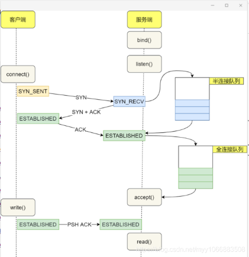

socket
====

### listenfd
- 最好使用LT，因为ET会使得在高并发的情况下有的客户端连接不上，非要ET那么一定whlie ET
### connfd
- LT模式下
    - 阻塞和非阻塞效果一样，建议非阻塞
- ET模式下
    - 必须使用非阻塞IO，并且一次性读写完整数据
  
### C 实现的socket通信全过程

### 连接队列和半连接队列
- 
  - 参考[TCP 半连接队列和全连接队列满了会发生什么？又该如何应对？](https://www.cnblogs.com/xiaolincoding/p/12995358.html)
  - 参考[TCP 三次握手中的全连接与半连接队列](https://tech.yangqianguan.com/60d6ea482078082a378ec5ea/)
  - 不管是连接队列还是半连接队列，都有最大长度限制，超过限制时，
    ~~内核会直接丢弃，或返回 RST 包。~~
  - 全连接满
    - 参数/proc/sys/net/ipv4/tcp_abort_on_overflow 的控制
    - 为1:直接 abort，则回复 **RST** 给 client 端，此时 client 端会收到 Connection reset by peer 错误
    - 为0:则**直接把第三次握手的 ACK 丢弃**，后续等待 client 重发 ack，则后续 sever 端会响应或者 client 重发 ACK 超时。
      - 直接丢弃，这样半连接都进不来
  - 半连接满
    - /proc/sys/net/ipv4/tcp_syncookies 参数控制行为
      - 0:表示不启用 cookies，即当半连接队列溢出后，直接丢弃 SYN
      - 1:表示当半连接队列满了后，开启 cookies
      - 无论何时都会开启 cookies

