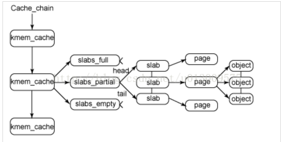
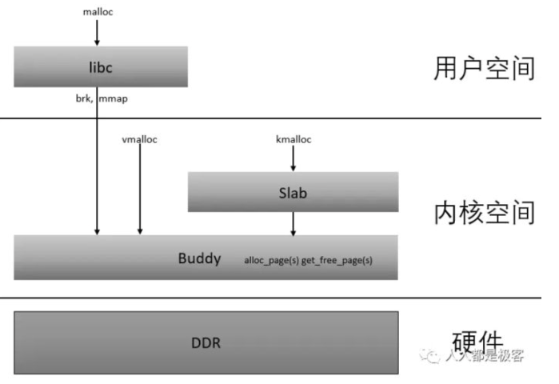

### buddy算法
参考：[面试官：你谈谈对物理内存和虚拟内存的理解，一文彻底搞懂](https://segmentfault.com/a/1190000022506020)
 
[也谈谈这四年来对内核的研究_chinaunis_老贴](http://bbs.chinaunix.net/thread-3559586-16-1.html)
收藏:[slab机制总结篇_csdn](https://blog.csdn.net/FreeeLinux/article/details/54575580)
- 用来解决外部碎片问题    
- 采用11 个链表
    - 每个链表管理不同大小的页块
    - 
- 分配过程
    - 比如：我需要申请4个页框，但是长度为4个连续页框块链表没有空闲的页框块，伙伴系统会从连续8个页框块的链表获取一个，并将其拆分为两个连续4个页框块，
      取其中一个，另外一个放入连续4个页框块的空闲链表中。释放的时候会检查，释放的这几个页框前后的页框是否空闲，能否组成下一级长度的块。
- 问题:
  - 这样长时间下来，就会没有大块连续的物理内存，在嵌入式系统当中使用CMA来解决该问题
    - 系统会预留出来一段内存
      - 当驱动不使用时，这段内存作为匿名内存or页缓存给用户进程 
      - 驱动使用时，占用的内存通过回收or迁移的方式腾出来，给驱动使用
  - 线程安全问题:
    - 这里正好有11个链表，那么每次分配锁的粒度减小在
  
## SLAB

- slab为了解决什么问题
  - 内部碎片
  - 减少了内存频繁的分配和回收
      - 释放的时候，把他们放在链表上，需要的时候使用就行。
      - 需要的时候，直接从链表上取下来就行
- 核心思想是什么？
  - slab的核心思想是以对象的观点来管理内存
  - 把不同的对象划分为不同的高速缓存组，例如task_struct 组，inode组
  - 高速缓存又划分为slab,一般情况下slab是一页
  - 
  - 结构大概如上图所示：
    - 一个kmem_cache是一个高速缓存组
    - 每个高速缓存组管理三类链表:full,partial,empty
      - full 都被分配出去
      - partial部分分配出去
      - 没有被分配
    - 当一个slab状态改变时，要归到相应的链表当中
  - 具体例子
    - 当内核某一个部分需要一个新的对象时
      - 先从partial链表当中找
      - 如果partial链表当中没有slab，就从empty链表当中找
      - 如果empty当中也没有，那么新建一个slab
- 好处

Linux 内核在运行过程中，常常会需要经常使用一些内核的数据结构（对象）。例如，当进程的某个线程第一次打开一个文件的时候，内核需要为该文件分配一个称为 file 的数据结构；当该文件被最终关闭的时候，内核必须释放此文件所关联的 file 数据结构。这些小块存储空间并不只在某个内核函数的内部使用，否则就可以使用当前线程的内核栈空间。同时，这些小块存储空间又是动态变化的，不可能像物理内存页面管理使用的 page 结构那样，有多大内存就有多少个 page 结构，形成一个静态长度的队列。而且由于内核无法预测运行中各种不同的内核对象对缓冲区的需求，因此不适合为每一种可能用到的对象建立一个“缓冲池”，因为那样的话很可能出现有些缓冲池已经耗尽而有些缓冲池中却又大量空闲缓冲区的现象。因此，内核只能采取更全局性的方法。
我们可以看出，内核对象的管理与用户进程中的堆管理比较相似，核心问题均是：如何高效地管理内存空间，使得可以快速地进行对象的分配和回收并减少内存碎片。但是内核不能简单地采用用户进程的基于堆的内存分配算法，这是因为内核对其对象的使用具有以下特殊性：
- 为什么不能像用户进程那样分配内存
    - 内核使用的对象种类繁多，应该使用一种统一的方法
    - 某些对象的使用特别频繁，所以不可以使用搜索的分配方法，比如 first_fit,best_fit
    - 不需要全部清零，有时可以保留初始化
    - 随着共享内存的多处理器系统的普及，多处理器同时分配某种类型对象的现象时常发生，使用Lock_free算法
    
- 总结
    - 对于每个内核中的相同类型的对象，如：task_struct、file_struct 等需要重复使用的小型内核数据对象，都会有个 slab 缓存池，缓存住大量常用的「已经初始化」的对象，每当要申请这种类型的对象时，就从缓存池的slab 列表中分配一个出去；而当要释放时，将其重新保存在该列表中，而不是直接返回给伙伴系统，从而避免内部碎片，同时也大大提高了内存分配性能。
    - slab 内存管理基于内核小对象，不用每次都分配一页内存，充分利用内存空间，避免内部碎片。
    - slab 对内核中频繁创建和释放的小对象做缓存，重复利用一些相同的对象，减少内存分配次数。
### slab分配
- 通用高速缓存分配
    - kmalloc
    - kfree
- 专用高速缓存分配
    - 
    - kmem_cache_create():用来分配一个kmem_cache
    - kmem_cache_alloc() :分配一个具体对象
    - kmem_cache_free()： 释放对象
    - kmem_cache_destory()：释放高速缓存组 
   

- 
- 总结
  - 物理内存分为不同的zone
  - 通过页表来映射不同的ZONE
  - 通过buddy和slab管理page

