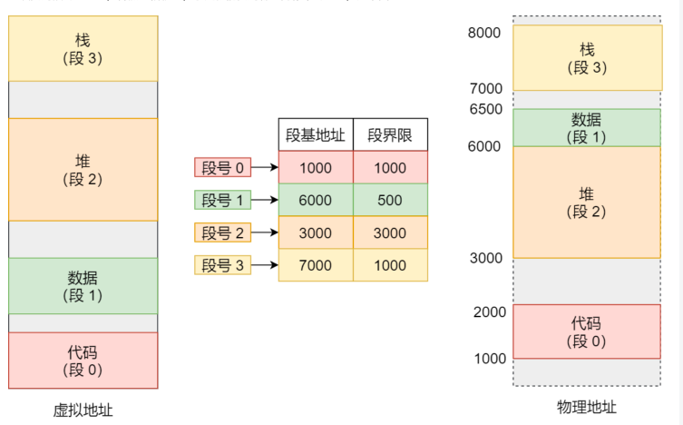

### 分页的由来
&emsp;最早只有分段存储，但是因为分段存储导致过多的内存碎片和内存交换效率低等问题，引出了分页的概念

### 为什么需要这么多级的页表，只有一级页表不行吗
&emsp;多个进程的所有页表都载入内存，占据太大空间，使用多级页表，最高一级的页表就能覆盖进程整个空间，具体少了哪一级的页表，在缺少时，载入内存即可

### 为什么64位操作系统来说，二级页表不够，需要四级页表,多级访问不会慢吗
- 64位太多了
- 怕慢所以引入了TLB的概念

### 4级页表是怎么工作的
- 全局页目录项 PGD（Page Global Directory）；
- 上层页目录项 PUD（Page Upper Directory）；
- 中间页目录项 PMD（Page Middle Directory）；
- 页表项 PTE（Page Table Entry）

### Linux的分页是怎么工作的
&emsp;Linux 系统主要采用了分页管理，但是由于 Intel 处理器的发展史，Linux 系统无法避免分段管理。于是 Linux 就把所有段的基地址设为 0，也就意味着所有程序的地址空间都是线性地址空间（虚拟地址），相当于屏蔽了 CPU 逻辑地址的概念，所以段只被用于访问控制和内存保护。 
    - 简单说明分段管理:
参考：[段式、页式内存管理以及linux采用的方案图解](https://blog.csdn.net/jinking01/article/details/107098437)
- 
- 

### 缺页中断

- 什么时候更新用于维护置换的数据结构？（每次发生却也中断时）？
- 每个ZONE维护自己的LRU
- 每个CPU有各自的pagevec结构