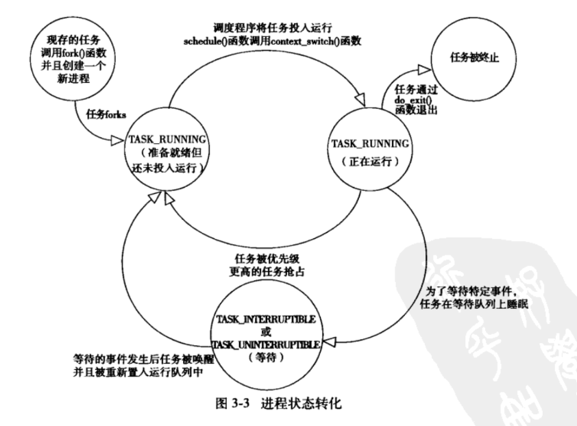

基本
======


### task_strut 背景
- Linux使用task_struct结构来维护进程的所有信息


```cgo
task_struct 主要结构
//ID相关 用来标识
pid_t pid;
pid_t tgid ; //thread group ID
//signal相关

// 进程状态
volatile long state;
//进程调度相关

//统计信息
u64 utime;用户态消耗CPU时间
u64 stime;内核态消耗CPU时间
unsigned long nvcsw;//资源上下文切换计数
unsigned long nivcsw; // 非自愿上下文切换计数
u64 start_time;//进程启动时间，不包含睡眠时间
u64 real_start_time;//包含睡眠的启动时间
//相关进程
    //父进程，子进程，兄弟进程
//进程权限
const struct cred __rcu *real_cred;
const struct cread __rcu *cred;
//内存管理

//void *stack

```

### 进程状态  [Linux进程状态](https://kerneltalks.com/linux/process-states-in-linux/)
- task_running        //正在执行or等待队列当中等待执行
- task_interruptible  //等待时间片和特定的事件发生
- task_uninteruptible //timeOut结束 or 等待的资源可用，被唤醒，与上面的区别是不响应信号
- __task_traced       // 被其它进程跟踪的进程，例如调用ptrace对调试程序进程跟踪
- __task_stoped       
    - 进程结束or终止当他们收到Kill 信号 or 他们进入退出状态
    - 进程放弃它自己的资源，但不释放在task_list中的资源，他去想父进程发送SIGCHLD信号  
    - 父进程收到了SIGCHLD 信号，那么父进程就该释放它的资源
- Zombie  :父进程收到 SIGCHLD信号到，释放资源这段期间，进入僵尸状态

