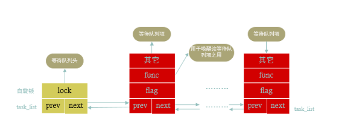

等待队列
=======

### 基本思想
- 参考[Linux设备驱动中的阻塞和非阻塞I/O](https://www.cnblogs.com/chen-farsight/p/6155476.html)
- 以队列为基础结构，进程调度紧密结合，实现异步事件通知，信号量在内核中也是等待队列实现
    -   
- 当一个task需要在某个wait_queue_head上睡眠时，将自己的task_struct信息封装到wait_queue中，
  然后挂载到wait_queue的链表中，执行调度睡眠。当某些事件发生后，
  另一个任务（进程 or 中断服务）会唤醒wait_queue_head上的某个或者所有任务，唤醒工作也就是将等待队列中的任务设置为可调度的状态，并且从队列中删除。放入到可执行红黑树当中 
  - kthreadd进程负责内核线程的管理和调度，内核中进程调度的等待队列由它执行

