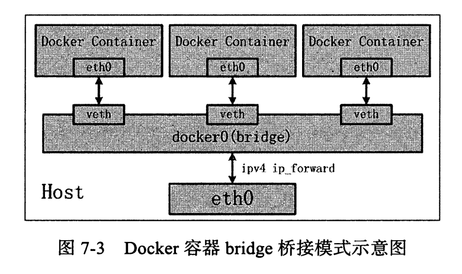
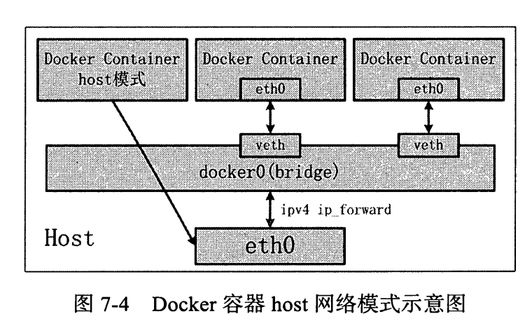
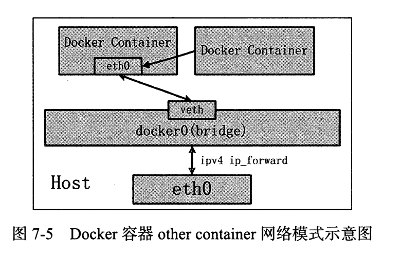
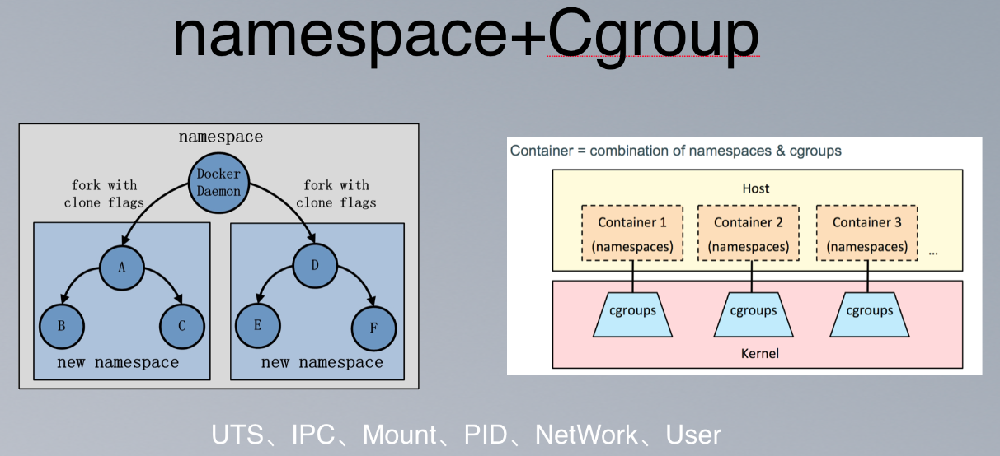

Docker
========

### NameSpace
- Linux内核用来隔离内核资源的方式，通过namespace进程只能看到
和自己相关的资源， 该技术是一种全局资源的一种封装隔离
  - 拥有自己独立的主机名、进程ID系统、IPC、网络、文件系统、用户等等资源

Linux提供了如下几种Namespace

       Namespace   变量               隔离资源
       Cgroup      CLONE_NEWCGROUP   Cgroup 根目录
       IPC         CLONE_NEWIPC      System V IPC, POSIX 消息队列等
       Network     CLONE_NEWNET      网络设备，协议栈、端口等
       Mount       CLONE_NEWNS       挂载点
       PID         CLONE_NEWPID      进程ID
       User        CLONE_NEWUSER     用户和group ID
       UTS         CLONE_NEWUTS      Hostname和NIS域名
    链接：https://www.zhihu.com/question/24964878/answer/139508652
    来源：知乎
Namespace API提供了三种系统调用接口：

- clone()：创建新的进程
- setns()：允许指定进程加入特定的namespace
- unshare()：将指定进程移除指定的namespace

## Docker容器网络

#### 网络模式
- bridge桥接

    - DNAT：用于 正在监听的容器接受请求时，将请求的ip和port替换
    - SNAT：对容器向外的主动请求，将ip替换成宿主机ip
- host模式
 
    - 该模式下，容器和宿主机共享网络命名空间
    - 缺点就是缺少了隔离，造成端口资源的竞争
- other container

    - 隔离性在bridge和host之间
    - 牺牲隔离性带来了容器间互访简约网络配置以及高效的传输效率，增容器之间的网络黏性
- none
    - 没有网络资源，只有loopback网络接口

### 总结
- 参考[美团容器平台架构及容器技术实践](https://tech.meituan.com/2018/11/15/docker-architecture-and-evolution-practice.html)
- 
  - namespace+cgroup
    - namespace:同一个namespace中的进程能够互相通信，但看不见其他namespace中的进程
    - cgroups:此外，为了限制namespace对物理资源的使用，对进程能使用的CPU、内存等资源需要做一定的限制。这就是Cgroup技术，Cgroup是Control group的意思。比如我们常说的4c4g的容器，实际上是限制这个容器namespace中所用的进程，最多能够使用4核的计算资源和4GB的内存