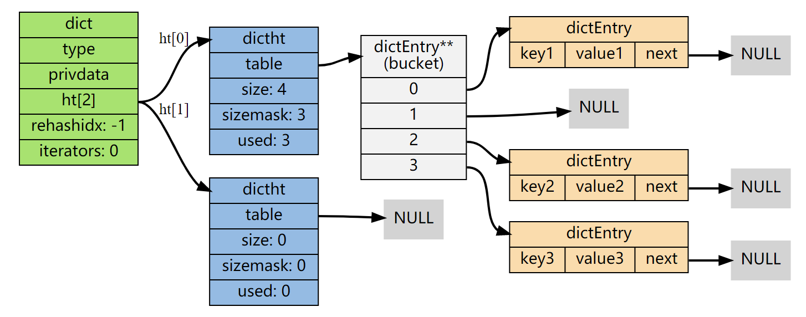
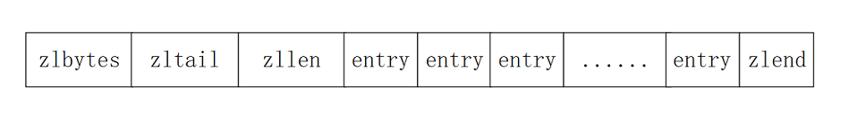
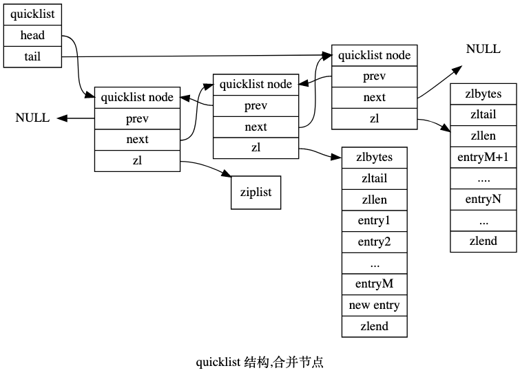

数据结构
=====

### String

- 动态字符串sds
```cgo
struct sdshdr {

    int len;        //buf中已占用空间的长度

    int free;       //buf中剩余可用空间的长度

    char buf[];     //初始化sds分配的数据空间，而且是柔性数组（Flexible array member）

};

```
- 兼容C的一些处理字符串的函数，因为它的基本结构中包含C语言字符串
- 对比简单的C语言字符串
  - 二进制安全，因为它的结构当中，包含了长度变量，所以以前的结尾符号不会
  - 获取长度复杂度O(1)
  - 杜绝缓冲区溢出，因为表头的存在
  - 空间预分配策略
    - 如果free的长度大于 要扩展的长度，那么不懂
    - 不够用的话，那么如果新的长度小于1M，那么最后新的长度为，预达到长度的2倍
    - 如果大于1M的话，那么最后占用的字符串空间为newLen+1M
  - 惰性空间释放
    - 缩短时，不会立即释放，而是增加free变量的大小，方便未来使用
终端字符串
  - *隐藏表头*地址通过，函数传参值传递sds 结构对象，该对象代表的只是buf的地址
```cgo
sds sdsMakeRoomFor(sds s, size_t addlen) {      //对 sds 中 buf 的长度进行扩展
    struct sdshdr *sh, *newsh;
    size_t free = sdsavail(s);  //获得s的未使用空间长度
    size_t len, newlen;

    //free的长度够用不用扩展直接返回
    if (free >= addlen) return s;  

    //free长度不够用，需要扩展
    len = sdslen(s);    //获得s字符串的长度
    sh = (void*) (s-(sizeof(struct sdshdr)));       //获取表头地址
    newlen = (len+addlen);  //扩展后的新长度

    //空间预分配     
    //#define SDS_MAX_PREALLOC (1024*1024)  
    //预先分配内存的最大长度为 1MB
    if (newlen < SDS_MAX_PREALLOC)  //新长度小于“最大预分配长度”，就直接将扩展的新长度乘2
        newlen *= 2;
    else
        newlen += SDS_MAX_PREALLOC; //新长度大于“最大预分配长度”，就在加上一个“最大预分配长度”
    newsh = zrealloc(sh, sizeof(struct sdshdr)+newlen+1);   //获得新的扩展空间的地址
    if (newsh == NULL) return NULL;

    newsh->free = newlen - len; //更新新空间的未使用的空间free
    return newsh->buf;
}

```

```cgo
static inline size_t sdslen(const sds s) {      //计算buf中字符串的长度
   struct sdshdr *sh = (void*)(s-(sizeof(struct sdshdr))); //s指针地址减去结构体大小就是结构体的地址
   return sh->len;
}
```
### List
- 场景
    - 消息队列
    - 评论列表，朋友圈点赞，排行榜
- 对比其他的数据结构
  - 插入删除更方便
    ```cgo
    typedef struct list {
        listNode *head;     //链表头结点指针
        listNode *tail;     //链表尾结点指针
    
        //下面的三个函数指针就像类中的成员函数一样
        void *(*dup)(void *ptr);    //复制链表节点保存的值
        void (*free)(void *ptr);    //释放链表节点保存的值
        int (*match)(void *ptr, void *key); //比较链表节点所保存的节点值和另一个输入的值是否相等
        unsigned long len;      //链表长度计数器
    } list;
    - 通过三个函数指针实现多态，针对不同的对象从而实现不同的方法
    ```

### 字典dict
- 和其他数据结构对比
  - 没有范围查询
  - 单点查询最快
- 
- 其中各种变量的含义
    - type保存操作字典不同类型K和v的函数
    - iterators:正在迭代的迭代器数量
    - size:hash table的大小
    - sizemask:size-1
    - used:hash table已使用的节点数量
- 什么是渐进式hash[参考](https://juejin.cn/post/6844904053227405325)
  - 为h1[1]分配空间，维护两个hash表
  - rehashidx置0，表示工作
  - 在 rehash 进行期间， 每次对字典执行添加、删除、查找或者更新操作时， 程序除了执行指定的操作以外， 还会顺带将ht[0]哈希表在rehashidx索引上的所有键值对 rehash 到ht[1]， 当 rehash 工作完成之后， 程序将rehashidx属性的值增一。
  - 随着字典操作的不断执行， 最终在某个时间点上， ht[0] 的所有键值对都会被 rehash 至 ht[1] ， 这时程序将 rehashidx 属性的值设为 -1 ， 表示 rehash 操作已完成。
  - 在渐进的过程当中，ht[0]只减不增 
- 哈希算法应该具有的性质
  - 无法从输出推导出输入，不可逆
  - 雪崩效应:改变一个bit , 几乎一般的bit都反正改变
  
### 跳表skiplist
- zset底层 [跳表 OI-wiki](https://oi-wiki.org/ds/skiplist/)
    - 新建节点获得当前层数
      ```cgo
      int randomLevel() {
        int lv = 1;
        // MAXL = 32, S = 0xFFFF, PS = S * P, P = 1 / 4
        while ((rand() & S) < PS) ++lv;
        return min(MAXL, lv);
      }
      ```
    - 查询：
      
      ```cgo
      /*
      从高level层向前找，每一层到搜不到就下一层继续找
      */
      void find(const K& key) {
        SkipListNode<K, V>* p = head;
        
        // 找到该层最后一个键值小于key的节点，然后走向下一层
        for (int i = level; i >= 0; --i) {
          while (p->forward[i]->key < key) {
            p = p->forward[i];
          }
        }
        // 现在是小于，所以还需要再往后走一步
        p = p->forward[0];
        
        // 成功找到节点
        if (p->key == key)
            return p->value;
        
        // 节点不存在，返回INVALID
        return tail->value;
      }
      ```
    - 插入
      ```cgo
      /*
      还是先找到那个元素，记住在找到元素位置的过程中，记录每一次层转折点的节点
      后面新建一个节点时，在转折点的后方插入该节点。
      */
          void insert(const K &key, const V &value) {
            // 用于记录需要修改的节点
            SkipListNode<K, V> *update[MAXL + 1];
        
            SkipListNode<K, V> *p = head;
            for (int i = level; i >= 0; --i) {
              while (p->forward[i]->key < key) {
                p = p->forward[i];
              }
             // 第i层需要修改的节点为p
             update[i] = p;
            }
            p = p->forward[0];
            // 若已存在则修改
            if (p->key == key) {
              p->value = value;
              return;
            }
            // 获取新节点的最大层数
            int lv = randomLevel();
            if (lv > level) {
              lv = ++level;
              update[lv] = head;
            }
          // 新建节点
          SkipListNode<K, V> *newNode = new SkipListNode<K, V>(key, value, lv);
          // 在第0-lv层插入新节点
          for (int i = lv; i >= 0; --i) {
            p = update[i];
            newNode->forward[i] = p->forward[i];
            p->forward[i] = newNode;
          }
          ++length;
      }
      ```
    - 删除
     ```cgo
    /*
    1.还是插入类似，还是在查询过程中记录转折点，
    2.在后面的删除过程中，从下到上删除所有跳转
    3.最后，可以调整level值
    */
    bool erase(const K &key) {
      // 用于记录需要修改的节点
      SkipListNode<K, V> *update[MAXL + 1];
    
      SkipListNode<K, V> *p = head;
      for (int i = level; i >= 0; --i) {
        while (p->forward[i]->key < key) {
          p = p->forward[i];
        }
        // 第i层需要修改的节点为p
        update[i] = p;
      }
      p = p->forward[0];
    
      // 节点不存在
      if (p->key != key) return false;
    
      // 从最底层开始删除
      for (int i = 0; i <= level; ++i) {
        // 如果这层没有p删除就完成了
        if (update[i]->forward[i] != p) {
          break;
        }
        // 断开p的连接
        update[i]->forward[i] = p->forward[i];
      }
    
      // 回收空间
      delete p;
    
      // 删除节点可能会是最大层数减少
      while (level > 0 && head->forward[level] == tail) --level;
    
      // 跳表长度
      --length;
      return true;
    }
    ```
- 为什么使用跳跃表
    - 对比hash,他是有序的
    - 对比B+树，B树
    - 对比红黑树 
      - 跳表平均每个节点1.33个指针，相对平衡术的两个指针，更加节约内存
      - 复杂度与红黑树相同情况下，跳跃表实现相对简单，看起来直观
      - 高并发情况下，树需要rebalance可能涉及到整个树，相对来说调表只涉及到一部分。
- 本质是有序链表
  - 复杂度：最坏O(N),平均 log(N)
  
### 压缩链表和快速链表
- 应用场景
  - redis列表的底层
  - 列表用来发布订阅，用户*关注*对象推文，消息排行，大v所有粉丝
      - 如果这个大v是个热v，那么还可以吧这个列表拆成多个不同的小k,这样多个小列表读取速度要快
      - 为什么不用MySQL：QPS上限不够，直接打爆DB了
  - 消息队列[参考](https://www.cnblogs.com/hld123/p/14667675.html)
    - 好处:
      - 实现方便，使用rabbitMq,RocketMq会增加系统复杂度，运维成本，机器成本
      - Redis支持消息持久化，在服务端数据安全
      - 消息的延迟几乎为0
    - 缺点
      - 队列没有元素时，只能轮询，增大了Redis访问压力，也增加客户端压力
        - 如果使用BRPOP:没有元素时是阻塞的，可以减少轮询压力
      - 相较于其他的mq相比，稳定性可靠性不高
      - 不可以重复消费,分组消费，消息一被消费就被删除
      - 没有数据权重，只能先进先出
- 压缩链表
  - 但如果列表、散列或者有序集合的长度或者体积较小时，Redis会选择一种名 ziplist 的一种非结构化表示
    
  - 是一个连续的内存块
      - 由表头，若干entry，以及结尾标识符组成，通过编码规则提高内存利用率
      - 缺点：
  - 作用:牺牲时间，节约空间
    - 每次读取可能都要解码
    - 每次写入需要局部重新编码，并可能对内存里面数据进行移动
  - 
    - zlbytes:表示整个压缩链表所占用内存长度
    - ztail:表示链表中最后一个字节的偏移字节量
    - zllen:节点数量
    - zlend:尾部标识符
- 快速链表 redis3.2出现
  - 用在列表的底层实现
  - 
  - 与压缩链表进行比较：
  - 既保留了高效空间性质，又不让更新复杂度过高
  - 每一个ziplist的大小设置
    
  - 当quickList很长的时候，会采用压缩算法对除了头部和尾部的节点进行压缩
    - 压缩算法采用：LZF
        - 使用压缩算法原因是：两端数据访问频率较高，中间访问频率低
    - 压缩深度为0：不压缩
    - 压缩深度为1:除了head,tail都进行压缩
  
### Set
- 背景，底层结构不是intset就是hashtable
- intset:元素都是int,并且数量在512内(512是默认值，可以配置)
  - 体积较小的set的非结构化表示方法
      - 不仅降低了内存，还
  - intset与ziplist非常类似
  - 对比
    - ziplist不同元素能使用不同的编码格式，intset只能统一
    - ziplist可以存储**任意二进制串**，intset只能存整数
    - ziplist内部元素时无序的，intset是有序的，可以进行二分来查找元素，添加元素时O(N)
  - 升级
    - 不支持降级
    - 过程
      - 当插入的新元素的类型要比原来内部的类型长度都大的时候，要升级
      - 首先分配新的空间，size(new编码类型长度)*len
      - 然后从大到小插入到新的空间当中
      - 最后插入新的元素
    - 好处
      - 节约空间
      - 提升灵活性，可以任意将各种不同长度大小的整数，插入到集合中


- hashtable


### Hash

### ZSet


