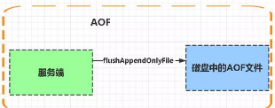
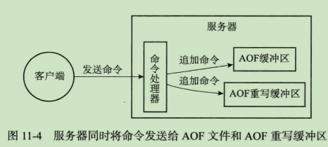
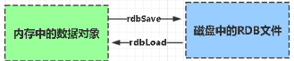

持久化
====

### AOF
- 
- 实现 参考[学习笔记-Redis设计与实现-AOF持久化](https://blog.51cto.com/abelxu/1899752)
  - 命令追加
    - 服务器在执行完一个写命令之后，会以**协议RESP格式**将被执行的写命令**追加**到服务器状态的aof_buf缓冲区的末尾。
  - AOF文件写入
    - buf-> aof文件
  - AOF同步  
    - 三种策略
        - always :每次写入都伴随刷盘
        - everysec 每隔一秒执行一次刷磁盘
        - no  : 这事怎么来做交给内核
- 载入与重写
    - 载入:创建一个伪客户端读取aof文件，使用该客户端执行写命令，直到全部执行完毕
    - 重写:aofrewrite | bgaofrewrite :解决aof文件膨胀问题，因为会有多个写记录是重复的
        - 阻塞：
            - 读数据库中k,v,用一条命令去记录，如果v元素偏大，那么拆命令
        - 子进程方式：
            - 
            - 重写过程中，命令不能丢失，写入到重新缓冲区
            - 子完成时，向父发送完成信号，父返回收到信号
            - 重写缓冲区追加到新AOF文件，此时AOF文件内容与数据库状态一致
            - 将新aof文件**原子地**覆盖到旧aof上
- 特点
    - 异步将Buffer中指令同步到从节点，从节点反馈一个偏移量代表同步到哪里了
    - 服务启动时，这些记录的操作逐条执行，从而重建原来数据
    
### RDB
- 
  
- 实现
- 特点
    - 特定时间间隔保存快照，到磁盘
    - 文件格式紧凑，体积小，恢复更快  
    -  两种命令来完成
      - save:会阻塞当前服务进程,直到RDB创建完成
      - bgsave :fork子进程，由子进程完成RDB文件创建
        - 好处：
          - 通过fork创建出来的子进程拥有父进程同样的内存空间，父进程对内存的修改，子进程没有感知，互不影响
          - fork创建子进程时，不会立刻触发大量内存拷贝带来的，避免大量拷贝内存带来的影响
### 比较
- 当Redis重启时候，AOF恢复优先，这是因为aof恢复完整度高
    - 因为RDB不可能较频繁创建
- AOF缺点是文件体积过大
- RDB备份时间较长，但是产生的文件小，方便进行容灾备份和主从备份

