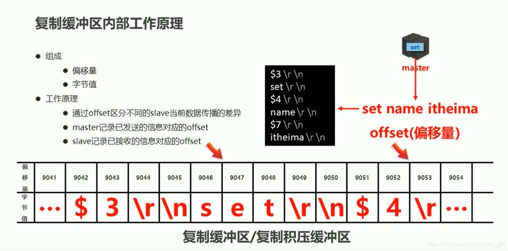
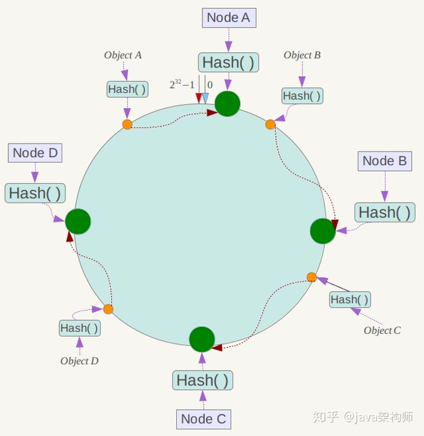

集群
======

### 基本概念

- 集群：
- 分片：分slot
- 主从:
- 哨兵

### 主从复制原理，主从一致性
- 基本概念
    - 赋值积压缓冲区 
      - 
      - 这个数据是环形的，如果设置过小，那么buffer覆盖，全量同步之后，又发生覆盖
        又要全量同步，造成死循环
    - 主从服务器赋值偏移量offset
        - mas维护多个 ind
        - sla维护一个
        
- 基本过程
    - 主从连接正常时进行简单的命令传播，维持着心跳
    - 主从网络中断时，从连接上之后，尝试同步，只获取断开连接期间丢失的命令流
    - 如果无法进行部分重同步就进行全量同步
    
- **全量同步**：一般用于初次复制的场景
  - 首先master将RDB同步给slave
  - 同步期间master将所有写入操作记录到buffer中
  - slave加载完成后，通过偏移量将该期间master写入的值同步到slave 
- **部分同步**:处理主从复制中网络原因造成的断线，当slave和master再次连接之后，
补发丢失的数据,避免全量同步开销。
    - 断线期间mas将写指令都写入到缓冲区
    - 从机不断尝试重连，直到成功
    - 从机发送偏移量给mas
    - mas比较offset是否还在buf,如果不在buf里则执行全量同步
    - 执行部分同步，同步增量数据

### 从服务器对于过期K的处理
- 从redis并不删除过期k，而是等待master redis 的 del 命令
- 但是从redis拥有自己的逻辑，它并不返回过期的k

## 集群演变过程 
- 参考:
    - [redis集群演变（单机架构、主从架构、哨兵架构、redis-cluster架构）](https://www.programminghunter.com/article/7837392418/)
    - [Redis 集群架构 ](https://www.cnblogs.com/crazymakercircle/p/14282108.html)
- 单节点
  - 优点:就是redis的优点
  - 缺点：
    - 没有高可用,对于redis实例压力过大
    - 持久化:运行过程当中，磁盘损坏了，数据永远无法恢复
- 主从
    - 优点:
      - 读写分离，大量读操作现在到了slave身上了
      - 主从都做了持久化之后，一台磁盘坏了，另一台还能工作
    - 缺点:
        - 主服务器挂了，必须手动设置一个新的master服务器
- 哨兵
  - 特点:一个or多个组成的sentinel系统，监控多个主服务器以及所有主服务器的从服务器，
    被监视的主服务器下线时，自动将下线的主服务器的从服务器当中某个升级为主，然后新的主代理旧主接受请求命令
    - sentinel是怎么发现master失败的
      - sentinel每秒  去ping master和所有slave
      - 其中一个sentinel ping master 的ack 超时，标记为主观下线
          - 若master重新向sentinel ping 命令返回，那么主观下线状态移除
          - 当没有足够的主观下线标记到master,那么客观下线状态移除
      - 发生主观下线时，所有的sentinel 都Ping 该master,若足够数量(可配置)的sentinel标记它为主观下线，那么就是客观下线
      - 正常情况下，sentinel 每10秒向所有的master slave发info 命令
      - 当有master 标记为客观下线时，sentinel每秒向该master所有的slave发info命令
    
  - 优点:
    - 包含了所有主从的优点
    - 主服务挂掉，不需要人工介入，哨兵可以把从服务变为主服务
  - 缺点:
      - 只有一个master的结构不可靠
      - 每台机器都保存全量数据，再做主从恢复时，耗时过长。

- 集群
    - 背景:解决单机redis容量有限问题，将数据按照一定规则分配给多台机器
    - 方案
      - 客户端分片
      - 代理分片  ：中心化集群方案
        - codis
        - Twemproxy  
      - 服务端分片 :去中心化
        - 一致性hash
        - redis cluster
  
### 客户端分片
- 特点：客户端通过固定的Hash算法，针对不同的key计算对应的Hash值，然后对不同的Redis节点进行读写，
  只要业务开发人员简单评估请求量数据量，让DBA人员部署即可
- 优点：业务方部署非常方便
- 缺点：
    - 需要业务方自己路由规则代码
    - 随着业务量变化，数据迁移不方便，从而引出了**一致性hash**

### 一致性hash
- 
- 应用 
    - 分布式缓存
    - 负载均衡
    - web session
    - 数据库分库分表
- 问题
    - 数据倾斜，有的节点分配到的Key多，有的key少
        - 解决:采用在hash环上插入虚节点的方案，更均匀分配key
    - 容错性和可扩展性
        - 相对较好，原因:在hash环上增删一个节点，影响的只有其中一个节点，影响比较小

### Redis Cluster 参考[Redis 集群教程](http://www.redis.cn/topics/cluster-tutorial.html)
- hash 槽
  - 16384个槽
  - 每个 key 通过 CRC16 校验后对 16384 取模来决定放置哪个槽
- 特点：
    - 无中心化，无Proxy，(客户端redis的sdk当中维护了路由逻辑)
    - 节点之间，可动态调整数据分布  
    - 可扩展性，可扩展到1000节点
    - 高可用，部分节点不可用时，集群仍可用  
    - 节点接gossip协议通信，投票机制完成选slave->master
- 缺点：
    - 非强一致性,会出现数据丢失
    - 资源隔离性较差，容易出现相互影响的情况。
    
### Codis
- 参考[codis vs redis cluster - 极客时间 ]
- 组件
  - 配置
    - codisfe
    - codis dashboard
    - 作用: 共同组成集群管理工具，dashboard负责集群管理工作，包括codis server,codis proxy,
    和数据迁移，fe负责 dashboard和web操作界面，便于我们直接在web页面进行集群管理。
  - codis proxy: 接收客户端请求，并将请求转发给特定的,codis server
  - codis server: redis实例
  - Zookeeper： 保存集群meta信息,例如数据位置信息(路由表),codis proxy信息。
  - Sentinel:监控主从健康状态，自动进行主从切换。
- 基本操作
    - 数据如何在集群中分布
      - slot 分配的粒度是一个group
        - 一个group相当于 1master 多slave的主从redis集群
      - codis 集群总共1024个slot
        - 手动分配这些slot  
        - 也可以让dash board 自动分配
      - slot 和 codis server的对应关系被称为路由表，在dash board上分配好路由表之后，
      dash board将路由表保存在zk中，codis-proxy将路由表缓存在本地。proxy对客户端打过来的请求进行路由。
    -  扩容、迁移
      - 迁移
        - 同步迁移
        - 异步迁移
      - 扩容
        - proxy扩容
        -
- 对比
  - 和redis cluster对比
    - 稳定性成熟度: codis 年份更久
    - 客户端兼容性: 原本连接单实例的客户端可以直接连接proxy,而想连接redis cluster就需要客户端开发
      新功能
    - 数据迁移性能: codis更好，以为支持异步
    - redis新命令，新特性: redis cluster更合适，codis是基于redis3.2.8的，它不支持后续的
    新数据结构，新特性。

- 总结

