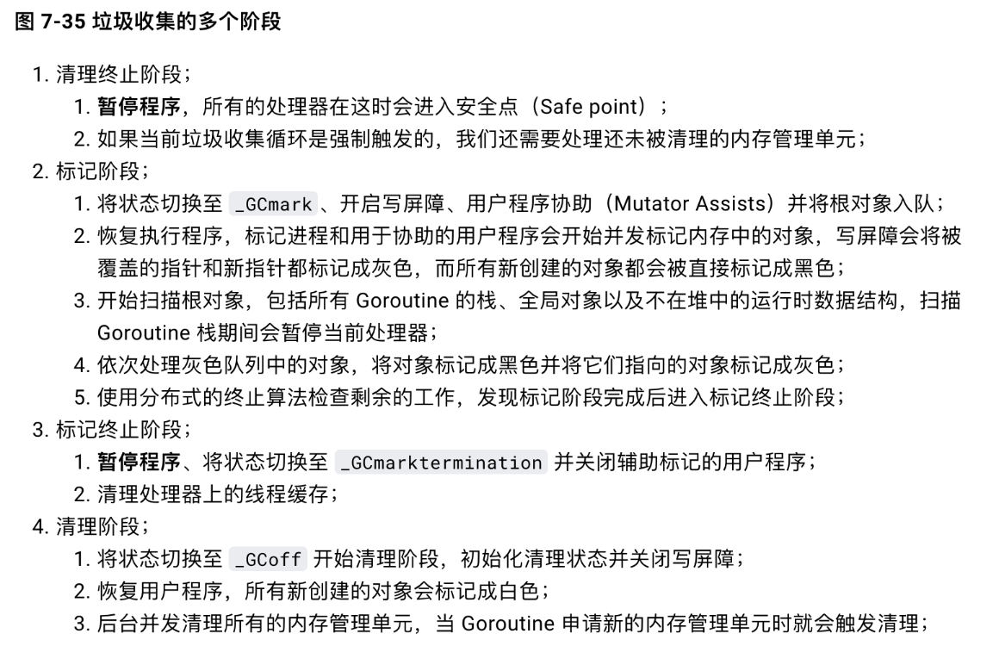

垃圾回收
=======
## 引用计数 
    string *p=new String("abc"）;那么这个abc字符串的变量的引用次数就从0变成1
   当引用次数变为0时，开始垃圾回收。

### 优点 
&emsp;渐进式。内存管理与用户程序的执行交织在一起，将 GC 的代价分散到整个程序。不像标记-清扫算法需要 STW (Stop The World，GC 的时候挂起用户程序)。算法易于实现。
&emsp;内存单元能够很快被回收。相比于其他垃圾回收算法，堆被耗尽或者达到某个阈值才会进行垃圾回收。
### 缺点 
    原始的引用计数不能处理循环引用。大概这是被诟病最多的缺点了。不过针对这个问题，也除了很多解决方案，比如强引用等。
    维护引用计数降低运行效率。内存单元的更新删除等都需要维护相关的内存单元的引用计数，相比于一些追踪式的垃圾回收算法并不需要这些代价。
    单元池 free list 实现的话不是 cache-friendly 的，这样会导致频繁的 cache miss，降低程序运行效率。
&emsp;问题是无法解决循环引用问题，就比如让链表的头指针=null,但是原本是一个循环列表，那么循环链表部分就不会被垃圾回收。 

## 标记清扫 
&emsp;标记-清扫算法是第一种自动内存管理，基于追踪的垃圾收集算法。算法思想在 70 年代就提出了，是一种非常古老的算法。内存单元并不会在变成垃圾立刻回收，而是保持不可达状态，直到到达某个阈值或者固定时间长度。这个时候系统会挂起用户程序，也就是 STW，转而执行垃圾回收程序。垃圾回收程序对所有的存活单元进行一次全局遍历确定哪些单元可以回收。算法分两个部分：标记（mark）和清扫（sweep）。
 标记阶段表明所有的存活单元，清扫阶段将垃圾单元回收。可视化可以参考下图。 

### 优点 
基于追踪的垃圾回收算法具有的优点：避免了引用计数算法的缺点（不能处理循环引用，需要维护指针） 

### 缺点 
缺点也很明显，需要 STW 

Golang GC
=======

### 阶段
- 参考[7.2 垃圾收集器](https://draveness.me/golang/docs/part3-runtime/ch07-memory/golang-garbage-collector/#723-%E5%AE%9E%E7%8E%B0%E5%8E%9F%E7%90%86)

  
### 内存泄漏

- 原因
  - zombie goroutine，这个goroutine上分配的内存对象将一直被这个僵尸goroutine引用着，
    进而导致gc无法回收这类对象，内存泄漏。
  - 全局数据结构挂住了本该释放的对象。虽然goroutine已经退出了，
    但是这些对象并没有从这类数据结构中删除，导致对象一直被引用，无法被回收。

