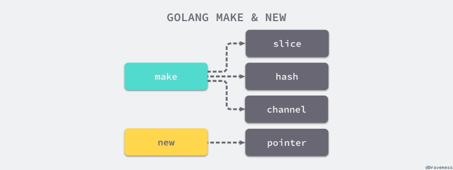

基本函数
=======
###panic()：<br>
    当出现错误的时候,

### 为什么go 1.1x 没有泛型
- 引入泛型会降低编译速度，运行速度，和增加编译器复杂度
- 目前社区的泛型提案，并不完善


- nil
    - pointer, channel, func, interface, map, or slice type. 的零值
    - 和空值的区别:空值对应的数据结构已经被初始化，但是确实没有数据
- string and []byte
  - 转化 : xxNew:=string(xx) , xxxNew:=[]byte(xxx)
  - 强转： 
  ```cgo
  func String2Bytes(s string) []byte {
      sh := (*reflect.StringHeader)(unsafe.Pointer(&s))
      bh := reflect.SliceHeader{
          Data: sh.Data,
          Len:  sh.Len,
          Cap:  sh.Len,
      }
      return *(*[]byte)(unsafe.Pointer(&bh))
  } 
  func Bytes2String(b []byte) string {
    return *(*string)(unsafe.Pointer(&b))
  }
  ```
  
- slice and array
  ```cgo
    type slice struct {
      array unsafe.Pointer
      len   int
      cap   int
    }
  ```
### panic
  - panic只会触发当前goroutine的defer
  - recover只能在defer中生效，作用是让goroutine恢复正常执行
  - ```go
      func main() {
        defer fmt.Println("in main")
        defer func() {
            defer func() {
                panic("panic again and again")
            }()
            panic("panic again")
        }()
  
        panic("panic once")
      }
  
      $ go run main.go
      in main
      panic: panic once
      panic: panic again
      panic: panic again and again

     ```


### make 和 new 区别
- 参考[make 和 new](https://draveness.me/golang/docs/part2-foundation/ch05-keyword/golang-make-and-new/)
- 
- new 的作用是根据传入的类型分配一片内存空间并返回指向这片内存空间的指针
- make的作用是初始化内置的数据结构，也就是我们在前面提到的切片、哈希表和 Channel2

- 编译上的区别
  - 编译类型检查阶段，Go语言会将代表 make 关键字的 OMAKE 节点根据参数类型的不同转换成了
    OMAKESLICE、OMAKEMAP 和 OMAKECHAN 三种不同类型的节点，这些节点会调用不同的运行时函数来初始化相应的数据结构。


