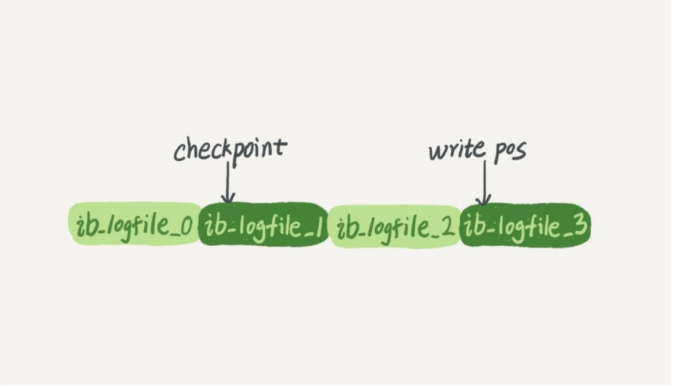
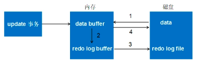

MySQL
====

### where group by having order执行顺序
- where ,group by having ,order

### group by
- group by 之后的 order by 不产生作用

### 引擎
- 区别
    - 索引：MySiam 索引和数据存储是完全分开的，主键索引上只有数据地址|innodb中，主键和是数据是存储在一个文件中的
    - MyIASM 不支持外键，innodb支持
    - 锁粒度：MySiam 表锁，innodb支持行锁
    - 事务的区别：MyIASM非事务安全，而InnoDB是事务安全的
    - 应用场景
    - MyIASM支持全文类型索引，InnoDB不支持

### 使用自增id作为主键

- 好处
  - 自动编号，速度快，查找有利
  - 数字型，存储空间小
  - 有一定迁移性
  
- 坏处
  - 合表操作多时，主键可能重复
  
- 业务无关，同时不暴露用户隐私
- 不可被修改

### Redo log
- 参考[必须了解的mysql三大日志-binlog、redo log和undo log](https://juejin.cn/post/6860252224930070536)

- 保证crash-safe
  - crash-safe:崩溃之后，重启后之前提交的记录都不会丢失
  - WAL(write ahead logging):再修改提交前，先写日志
- 因为 Innodb 是以**页**为单位进行磁盘交互的
  而一个事务很可能只修改一个数据页里面的几个字节，这个时候将完整的数据页刷到磁盘的话，太浪费资源了！
- 一个事务可能涉及修改多个数据页，并且这些数据页在物理上并不连续，使用随机IO写入性能太差！

- 
- 
    - redo log大小是固定的，一组4个文件，每个文件大小是1GB,共4GB
    - 从头开始写，写到末尾，又回头开始循环写
    - write pos是当前记录的位置，checkpoint是当前要擦除的位置
- 类型
  - **物理redo**:大部分时候。他记录了数据页的物理变化
  - 逻辑redo:记录数据页的逻辑变化

- 作用:用于数据库崩溃之后的恢复
- 存储
  - redo log buffer,是易失的，在内存中
  - redo log file，是持久的，保存在磁盘中
- 写redo的时机 参考[浅析MySQL事务中的redo与undo](https://segmentfault.com/a/1190000017888478)
  - 数据页修改完成之后，，在脏页刷磁盘之前，写入redo日志(先修改数据，再写日志)
  - redo日志比数据页先写回磁盘
  - 聚集索引、二级索引、undo页面的修改，均需要记录Redo日志。
  - 

- 怎么保证持久性的
  - Force Log at Commit 机制
  - 即当事务提交时，先将 redo log buffer 写入到 
    redo log file 进行持久化，
    待事务的commit操作完成时才算完成
    - 即，在持久化一个数据页之前，先讲内存中相应的日志页持久化。
  
### undolog
- 背景:记录的是数据的逻辑变化，为了在发生错误时回滚之前的操作，需要将之前的操作都记录下来，
  然后在发生错误时才可以回滚。

- 作用
  - 事务回滚:回滚的时候，逆序执行即可
  - MVCC
  
- 写入时机:
  - DML操作修改**聚簇索引**前，记录undo日志
  - 二级索引记录的修改，**不记录**undo日志
  
- 分类
  - insert undo log
      - ~~在事务提交之后，可以直接删除，因为，只对事务本身可见，对其他事务不可见，
        不需要进行purge操作~~ 不确定
  - update undo log

### binlog
- 背景
  - 用来作回滚还有同步的
  - 二进制日志，事件发生的时间，开始位置和结束位置等信息
  - 一种逻辑日志
  - 在MySQL的 server层产生该日志，redo log在存储引擎层产生
- 类型
   - statement:记录可能引起数据变更的sql语句
   - row:记录修改前得源数据，和修改后的目标数据，**不记录sql语句**
   - mixed
  
- 写入时机
  - 对于事务
      - 事务提交时，一次性写入binlog
  - 对于非事务
    - 每次语句执行成功之后，写入binlog

