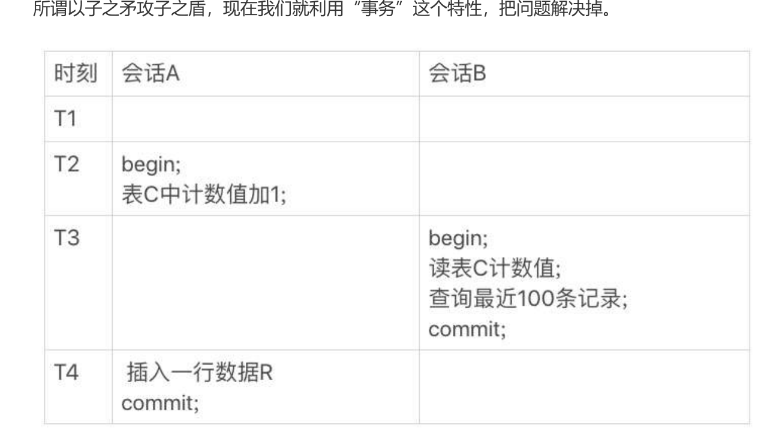

Count函数
==========

### 背景
- MyiSAM 将一个表数据多少行，直接存起来了，所以直接读
    - 如果加了where条件，MyiSAM也是不能直接返回的
- InnoDB 执行 count(*)时，将数据一行行从从引擎里读出来，然后累计计数。
- InnoDB为什么不想MyiSAM一样将行数存起来，因为在不同的事务中得到的数量不同
所以，InnoDB决定每次都读一遍
  
### count慢的解决办法
- 多开一张表，用来存储行数。利用InnoDB事务特性，只能看见提交之后的，
- 
  - B事务看到的就是正确的
### 各种Count的区别
- 效率排行 :count(字段)<count(主键 id)<count(1)≈count(*)
- count字段会检查字段是不是NULL
- count主键id 也会有繁琐的过程，检查主键Ids是否为空
- count(1)和count(*)专门做了优化不取值
    

