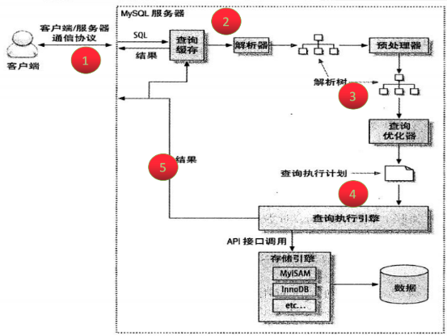
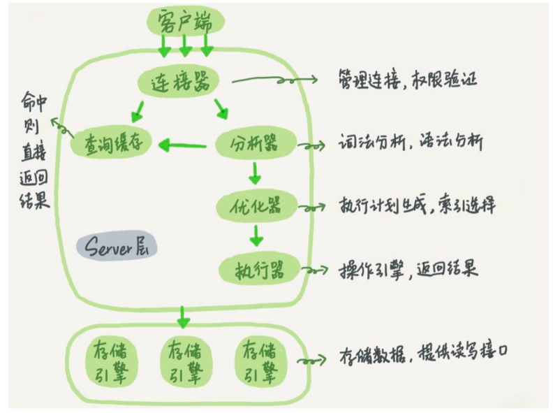
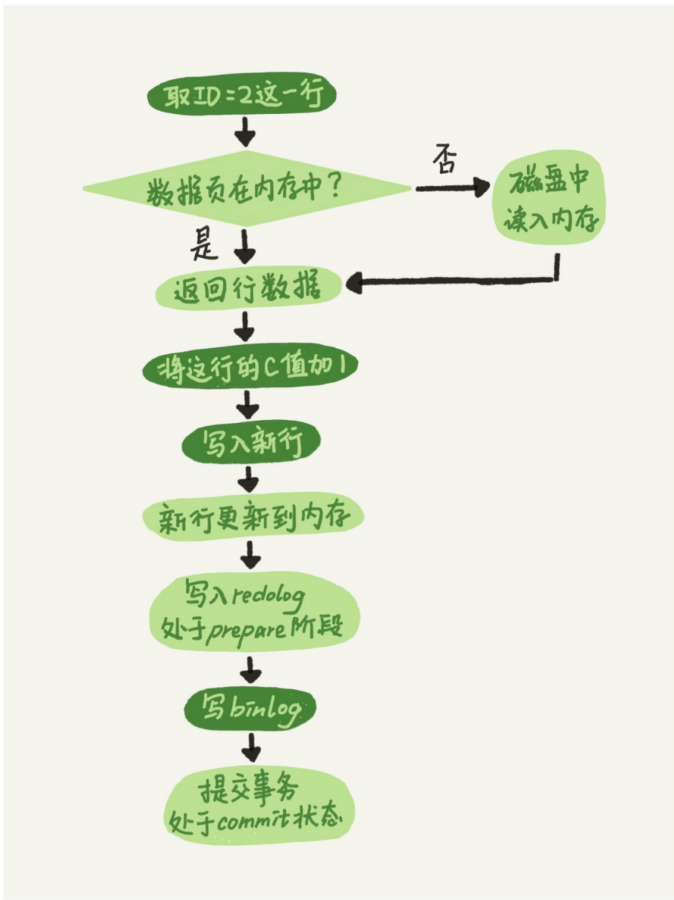

查询完整过程
=======
- 
    - 通信
    - 查询缓存
    - 查询优化处理:生成执行计划
    - 查询执行引擎
    - 返回客户端
  
  - 
### 查询优化处理
- 分析器
  - 词法分析
  - 语法分析

- 优化器
  - 作用:
      - 多个索引决定用哪个索引，存在联表决定各个表连接顺序
  - 执行完之后，该语句的执行方案就确定了
  
- 执行器
  - 先判断该用户对这个表是否有执行权限，没有权限返回错误
  - 执行逻辑
  

更新语句是怎么执行的
=======
- 更新语句也要走一遍前面的查询逻辑
- 除了上面之外，还有两个日志 redo log 和 binlog
- 
  - redo 的两段提交
    - 数据更新到内存
    - redo log prepare
    - 写binlog
    - redo log commit
  - 两段式提交的好处:

### MySQL是怎么恢复到任意状态的
- 找到最近一次的全量备份
- binlog重放
