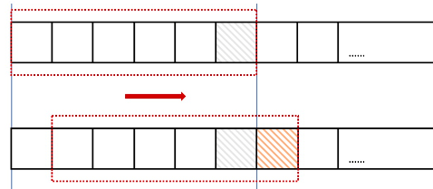

并发
=====

### 锁
- 最佳实践
    - 减少持有时间，缩小临界区
    - 优化锁的粒度
    - 读写分离:使用读写锁
    - 原子操作
    
- BadCase
    - 忽略锁的可重入性
    - golang总使用race detector 发现问题
- 追求极致
    - golang
        - Mutex太慢
        - 读写锁能优化一些
        - 原子操作虽然快，单没到极致  
        - UnsafePointer最快，只有一条方寸指令
    
- 锁演变
    - 80386处理器，只需要关闭中断，就能实现原子操作，但是需要进入内核态，所以性能
    不好
    - Lock+CMPSWAP(Lock 前缀锁定内存总线，内存总线为瓶颈)
    - P4 系列CPU：MESI 缓存一致性协议:锁的粒度->CacheLine
    - 自旋锁
    - Mutex:
        - golang:效率优先，兼顾公平
    
### 限流算法
- 单机限流
    - 计数器
        - 实现:计数器超过一定值不处理后续请求，当超过TimeInterval,cnt清零
        - 问题:突刺线性
        - 演变：滑动窗口算法 ，该方法对比于普通的计数器方法划分了更小的粒度，
    窗口内划分了更多的小格，每个小格都是一个计数器，当窗口内数量达到上限，不接受请求， 否则接受请求
          - 
    - 漏桶
        - 特点:以固定的速度流出水
        - 问题：桶满了，请求丢弃
    - 令牌桶
        - 特点:系统以恒定的速度产生令牌，将这些令牌放入一个令牌桶当中，多余的令牌丢弃，每一个请求消耗一个令牌，
    当没有令牌时，该请求无效
        
- 分布式限流
- 背景:若想实现分布式全局限流
```cgo

-- 计数器限流
-- 此处支持的最小单位时间是秒, 若将 expire 改成 pexpire 则可支持毫秒粒度.
-- KEYS[1]  string  限流的key
-- ARGV[1]  int     限流数
-- ARGV[2]  int     单位时间(秒)

local cnt = tonumber(redis.call("incr", KEYS[1]))

if (cnt == 1) then
    -- cnt 值为1说明之前不存在该值, 因此需要设置其过期时间
    redis.call("expire", KEYS[1], tonumber(ARGV[2]))
elseif (cnt > tonumber(ARGV[1])) then
    return -1
end 

return cnt
```


