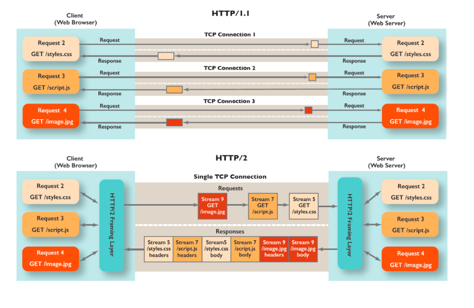
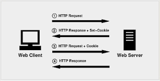
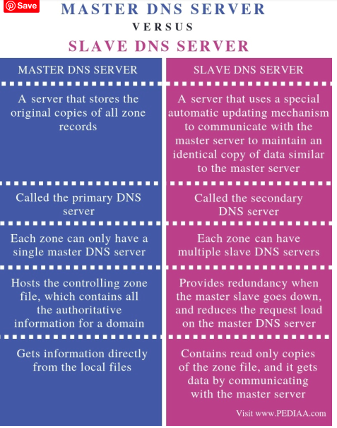

应用层
==================
# HTTP

#### HTTP进化
- 0.9版本
    - 客户端只能get请求并且没有协议头，只支持一种内容，纯文本。
    - 具有典型的无状态特性，每个事务独立进行处理，事务结束才释放连接
    - 如果请求的页面不存在，不返回错误码
- 1.0版本
    - 可以长连接
    - 请求和响应支持头域
    - 有了响应的状态行
    - 响应的内容不局限于文本形式
    - GET POST HEAD
- 1.1
    - 默认支持长连接
        - 流水线方式：在response前，可以发后面的req
        - 非流水线防水：只有response了，才能发后面的req
    - 支持管道，因为服务器而block住
    - 扩展头部：host字段和connection字段，通过Content-range支持断点续传、Authorization支持身份认证、支持缓存
- 2.0 参考 [Hypertext Transfer Protocol Version 2 (HTTP/2)](https://halfrost.com/http2_rfc7540/)
    - 支持多路复用
    - 首部压缩，双方都缓存一分cache fields表
    - 服务端推送，（客户端请求一个数据，服务端主动推送相关数据，这样下次请求直接从缓存里面得到
    
    
- 各自之间的区别：参考[HTTP1.0、HTTP1.1 和 HTTP2.0 的区别 ](https://juejin.cn/post/6844903489596833800)
    - 1.0和1.1之间区别
        - 1.1默认长连接
        - 1.0最早在1996年开始使用，1.1在99年开始广泛应用于各大浏览器的网络请求当中
        - 1.1首部压缩阶跃带宽
        - 缓存处理，1.1引入更多头部来处理缓存，
        - 带宽优化，增加range头域，只取其中某一部分 （返回码是206)
        
        -  Host头:HTTP1.1的请求消息和响应消息都应支持Host头域，且请求消息中如果没有Host头域会报告一个错误（400 Bad Request）,因为可能出现一个Ip地址上运行多个虚拟主机的情况，用Host来来区分
    - 1.1和2.0的区别
        - 二进制分帧层 参考[HTTP 1.1 vs HTTP.2 vs HTTP/2 with Push](https://freecontent.manning.com/animation-http-1-1-vs-http-2-vs-http-2-with-push/)
            - 
            - 在应用层和传输层之间
            - 优先级，流量控制，服务端推送
            - 帧，消息，流
                - 二进制分帧的二进制的意思是采用二进制格式来编码
                - 帧：长度，类型标志：比如header帧和Data帧：根据帧头的数据流标识符重新组装，不同数据流的帧交错传输
                - 消息：包含着帧，逻辑上的http消息，比如请求和响应，有一个或者多个帧组成
                - 流：包含着消息：是tcp连接的虚拟通道，每一个流都有一个唯一的整数标识符
        - 首部压缩 头字段用 cache fields+(gzip or compress压缩头部信息)
            - 使用了哈夫曼编码，如果Header中对应的value编码之后没减小，就不使用
        - 多路复用 : 
            - 多路仍然建立在一个TCP连接中，只解决了应用层的队首阻塞问题，但是没决绝TCP队首阻塞问题
            - 为什么之前采用阻塞，因为客户端无法指导接受的数据属于哪一次HTTP。所以阻塞
        - 服务端推送
          - 允许服务器在响应中提供客户端没有请求的数据(就是response里面多了一部分多余的)
       


#### HTTP 报文格式
- 参考[HTTP请求报文和HTTP响应报文](https://www.huaweicloud.com/articles/13241807.html)
```
请求报文
GET /admin_ui/rdx/core/images/close.png HTTP/1.1
Accept: */*
Referer: http://xxx.xxx.xxx.xxx/menu/neo
Accept-Language: en-US
User-Agent: Mozilla/4.0 (compatible; MSIE 7.0; Windows NT 6.1; WOW64; Trident/7.0; SLCC2; .NET CLR 2.0.50727; .NET CLR 3.5.30729; .NET CLR 3.0.30729; .NET4.0C; .NET4.0E)
Accept-Encoding: gzip, deflate
Host: xxx.xxx.xxx.xxx
Connection: Keep-Alive
Cookie: startupapp=neo; is_cisco_platform=0; rdx_pagination_size=250%20Per%20Page; SESSID=deb31b8eb9ca68a514cf55777744e339

<method><request-URL><version>
<headers>

<entity-body>


-------------------------
响应报文
HTTP/1.1 200 OK
Date: Sat, 31 Dec 2005 23:59:59 GMT
Content-Type: text/html;charset=ISO-8859-1
Content-Length: 122

＜html＞
＜head＞
＜title＞Wrox Homepage＜/title＞
＜/head＞
＜body＞
＜!-- body goes here --＞
＜/body＞
＜/html＞


<version><status><reason-phrase>
<headers>

<entity-body>

```


 
#### HTTP方法
- GET
    - 条件get：请求消息中包含 If-Modified-Since，If-Unmodified-Since，If-Match,，If-None-Match,或者 If-Range头域 。一个条件GET方法会请求满足条件头域的实体
    - 部分get：请求方法包含一个Range头域，那么GET方法就变成“部分Get”方法，会请求实体的一部分
- POST：
    - 一些请求使用post原因，因为某些民营快带供应商会缓存get的结果，不符合预期
- HEAD：
    - HEAD方法可以看做是GET方法的简化版，只传递响应头而不响应实体信息，避免传递body数据而浪费，可以用来检查文件是否更新，或者有效性和可访问性
    - Head请求的响应是可以缓存的，响应的信息可用于更新以前资源的缓存实体，如果新的域值指明缓存实体和源服务器上最新实体的不同，那么缓存应当过期
- DELETE
    


#### HTTP Get 方法和 post 方法区别
- 浏览器上:
  - get可收藏，post不可
  - 有的浏览器post发两边，浏览器先发送header，服务器响应100 continue，浏览器再发送data，服务器响应200 ok
#### HTTP的队首阻塞问题:参考[http协议的队首阻塞](https://www.cnblogs.com/hustdc/p/8487366.html)
- 1.就是需要排队，队首的事情没有处理完的时候，后面的人都要等着。
- 2.可见，http1.0的队首组塞发生在客户端。对于同一个tcp连接，所有的http1.0请求放入队列中，只有前一个请求的响应收到了，然后才能发送下一个请求.
- 3.可见，http1.1的队首阻塞发生在服务器端。对于同一个tcp连接，http1.1允许一次发送多个http1.1请求，也就是说，不必等前一个响应收到，就可以发送下一个请求，这样    就解决了http1.0的客户端的队首阻塞。但是，http1.1规定，服务器端的响应的发送要根据请求被接收的顺序排队，也就是说，先接收到的请求的响应也要先发送。这样造成的问题是，如果最先收到的请求的处理时间长的话，响应生成也慢，就会阻塞已经生成了的响应的发送。也会造成队首阻塞。
- 4.只要tcp没有人在用那么就可以发送已经生成的requst或者reponse的数据，在两端都不用等，从而彻底解决了http协议层面的队首阻塞问题。http2无论在客户端还是在服务器端都不需要排队，在同一个tcp连接上，有多个stream，由各个stream发送和接收http请求，各个steam相互独立，互不阻塞。 
    


### cookie 和 session<br>
- 
  
- cookie
  - 会话cookie :浏览器关闭而消失
  - 非会话cookie :保存在本地，浏览器关闭不消失

- 减轻服务器的压力应当使用cookie
- cookie
    - 要么是服务器set-cookie得到
    - 要么是服务器通过javascript设置的
    
### HTTP状态码<br>
参考 
[常用对照表——状态码](https://tool.oschina.net/commons?type=5)

- 1XX：信息，服务器收到请求，需要请求者继续执行操作
- 2XX：成功，操作被成功接收并处理
- 3XX：重定向，需要进一步的操作以完成请求
- 4XX：客户端错误，请求包含语法错误或无法完成请求
- 5XX：服务器错误，服务器在处理请求的过程中发生了错误

- 200 OK
- 301 :Moved Permanently
- 302:Found (Previously "Moved temporarily")
- 400
  - 客户端请求有误，不能被服务器理解，例如header中cookie过大
- 401
  - 请求未授权
- 403 
  - 服务器收到请求，但是拒绝提供服务。
- 404
  - 资源找不到，输入了错误的URL
- 499
    - nginx 自身定义的状态码，一般是由于客户端主动断开连接导致的
- 500
  - 服务器发生不可预期的错误。
- 502
  - 对用户响应的请求超时造成
- 503
  - 服务器当前不能处理客户端请求一段时间后可能恢复正常。
- 504
  - Gateway Timeout 是一种HTTP协议的服务器端错误状态代码
### RESTFUL API<br>
- get
  - 语义特点: 安全幂等，可缓存
  - 向服务器索取数据（幂等）
- post
  - 语义特点: 不安全，不幂等，不可缓存
- put
  - 更新（幂等）
- delete
  - 幂等
 

### header

- Content-Type: 发送数据的数据类型
- Content-Length
    - 设Content-Length = x
    - x > real_receive_len : 一直等待下一个字节，从而超时
    - x < real_receive_len :内容被截取


### http 断点续传
- 原理


### 浏览器输入URL发生了什么<br>
[当···时发生了什么？](https://github.com/skyline75489/what-happens-when-zh_CN)


--------
- HSTS
- 从url抽取域名  
- 浏览器缓存
- 发起DNS解析请求
  - 系统缓存 本机hosts
  - DNS解析器缓存
  - 想远端DNS服务器请求解析  
    - ARP
    - 路由转发   
    - 套接字
        - UDP 报文
- 想发送HTTPS请求
    - TCP握手
      - TCP
    - TLS握手
    - HTTP
- 服务器请求处理
- 浏览器显示

----------

- 服务器处理请求并返回HTTP报文
- 浏览器解析渲染网页
- 连接结束


## HTTPS<br>
[Wireshark抓包帮你理清HTTPS请求流程_非常全面！！！](https://cloud.tencent.com/developer/article/1644729)
<br>
[HTTPS 为什么更安全，先看这些_讲得来由很清楚](https://zhuanlan.zhihu.com/p/25324735)
<br>
[使用wireshark分析HTTPS流程的建立](https://my.oschina.net/u/2457218/blog/794322)
### HTTP为什么安全<br>
#### 1.应该使用对称加密传输数据，那么如何获取对称加密的秘钥<br>
#### 2.使用非对称加密得到用于对称加密的秘钥，那么如何得到非对称加密的公钥<br>
#### 3.使用得到CA认可的公钥，那么去和确保这个确实是CA是真的CA<br>
#### 4.使用数字签名技术<br>
- 签字者发送
    - 数据
    - 加密（hash(数据)）
- 验证方
    - 对数据进行hash->h1
    - 对加密后的数据进行解密->h2
    - 如果h1==h2验证成功
<br>

### 客户端是验证证书过程<br>
<br>
- TCP three-way handshake
- client helo
  - ssl版本
  - 随机数
  - SessionID
  - 加密组件
  - 压缩方法
  - 等等
- server hello
  - ssl版本
  - 随机数
  - 加密组件(从clienthello报文中得到的)
  - 和上面对应上
- verify server Certificate
    - 抽到数字证书
    - 使用相同的hash算法得到数字证书的hash值得到'H1'
    - 使用CA公钥来解密证书中的 certificate signature 得到 H2
    - 若H2==H1那么信任证书。 [参考](https://www.cnblogs.com/MR-Guo/p/11584730.html)

- client Key Exchange
- verify client Certificate (if required)  
- Sever Hello Done
- exchange messages with shared secret key

### 再详细的HTTPS呢
&emsp;&emsp;客户端得到证书并且验证成功之后，生成一个pre_master_key ,它将用来跟服务端和客户端在Hello阶段产生的随机数结合在一起生成 Master Secret 。在客户端使用服务端的公钥对PreMaster Secret进行加密之后传送给服务端，服务端将使用私钥进行解密得到PreMaster secret。也就是说服务端和客户端都有一份相同的PreMaster secret和随机数。PreMaster secret前两个字节是TLS的版本号，这是一个比较重要的用来核对握手数据的版本号，因为在Client Hello阶段，客户端会发送一份加密套件列表和当前支持的SSL/TLS的版本号给服务端，而且是使用明文传送的，如果握手的数据包被破解之后，攻击者很有可能串改数据包，选择一个安全性较低的加密套件和版本给服务端，从而对数据进行破解。所以，服务端需要对密文中解密出来对的PreMaster版本号跟之前Client Hello阶段的版本号进行对比，如果版本号变低，则说明被串改，则立即停止发送任何消息。<br>
&emsp;&emsp;Master secret<br>
&emsp;&emsp;上面已经提到，由于服务端和客户端都有一份相同的PreMaster secret和随机数，这个随机数将作为后面产生Master secret的种子，结合PreMaster secret，客户端和服务端将计算出同样的Master secret。<br>
&emsp;&emsp;Master secret是有系列的hash值组成的，它将作为数据加解密相关的secret的 Key Material 的一部分。Key Material最终解析出来的数据如下：<br>
       
<br>

   &emsp;&emsp;在所有的握手阶段都完成之后，就可以开始传送应用数据了。应用数据在传输之前，首先要附加上MAC secret，然后再对这个数据包使用write encryption key进行加密。在服务端收到密文之后，使用Client write encryption key进行解密，客户端收到服务端的数据之后使用Server write encryption key进行解密，然后使用各自的write MAC key对数据的完整性包括是否被串改进行验证。<br>

### 在HTTPS基础上客户端每次请求都需要SSL握手传递秘钥吗
        浏览器可以以sessionID为单位临时存储用来加密的key等关键参数
        在*TLS握手阶段*浏览器会把自己的session id发给服务器，若服务器中存在一个以sessionId为索引的数据结构的话，那么检查里面
        是否有 session key,有的话就不需要交换秘钥了，这样避免了大量的幂、指数运算，如果没有的话正常走最开始的流程

### HTTPS 的安全性/HSTS<br>

### SSL/TLS<br>
#### SSL是什么:<br>
&emsp;应用层和网络层之间的一种协议层。SSL通过相互认证数字签名保证完整性、使用加密确保私密性，实现客户端和服务器之间的安全通讯。协议分成SSL记录协议和SSL握手协议。<br>
SSL协议可分为两层：<br>
SSL记录协议(SSL Record Protocol)：它建立在可靠的传输协议(如TCP)之上，为高层协议提供数据封装、压缩、加密等基本功能的支持。 SSL握手协议(SSL Handshake Protocol)：它建立在SSL记录协议之上，用于在实际的数据传输开始前，通讯双方进行身份认证、协商加密算法、交换加密密钥等。<br>
#### SSL作用:<br>
    1）认证用户和服务器，确保数据发送到正确的客户机和服务器；<br>
    2）加密数据以防止数据中途被窃取；<br>
    3）维护数据的完整性，确保数据在传输过程中不被改变。<br>

### TLS是什么:<br>
    用于两个应用程序之间提供保密性和数据完整性。该协议由两层组成：TLS记录协议和TLS握手协议。<br>


## SSL/TLS区别：
    Well, 'TLS is actually just a more recent version of SSL'. It fixes some security vulnerabilities in the earlier SSL protocols.
    
   
参考：
[SSL与TLS的区别以及介绍](https://www.cnblogs.com/susanhonly/p/7489532.html)


DNS
=======================
### dns tcp和udp使用情况
[DNS使用的是TCP协议还是UDP协议 ](https://www.iteye.com/blog/benbenxiongyuan-1088085)
&emsp;&emsp;DNS的规范规定了2种类型的DNS服务器，一个叫主DNS服务器，一个叫辅助DNS服务器。
在一个区中主DNS服务器从自己本机的数据文件中读取该区的DNS数据信息，而辅助DNS服务器则从区的主DNS服务器中读取该区的DNS数据信息。当一个辅助DNS服务器启动时，它需要与主DNS服务器通信，并加载数据信息，这就叫做区传送（zone transfer）。
- master and slave区别
  - 
- 区域传送时使用TCP
    - 辅域名服务器会定时（一般时3小时）向主域名服务器进行查询以便了解数据是否有变动。如有变动，则会执行一次区域传送，进行数据同步。区域传送将使用TCP而不是UDP，因为数据同步传送的数据量比一个请求和应答的数据量要多得多。
- 其他都是用UDP

### 递归查询和迭代查询  
- 客户端与本地域名服务器之间是递归查询
- 本地域名服务器和其他服务器之间是迭代查询关系，具体看下面详细过程
### dns过程
- 使用dig +trace @8.8.8.8 www.baidu.com


        root@iZuf6emabkroyik200bcgkZ:~# dig +trace @8.8.8.8  www.baidu.com
        ; <<>> DiG 9.11.3-1ubuntu1.7-Ubuntu <<>> +trace @8.8.8.8 www.baidu.com
        ; (1 server found)
        ;; global options: +cmd
        .                       85643   IN      NS      a.root-servers.net.
        .                       85643   IN      NS      b.root-servers.net.
        .                       85643   IN      NS      c.root-servers.net.
        .                       85643   IN      NS      d.root-servers.net.
        .                       85643   IN      NS      e.root-servers.net.
        .                       85643   IN      NS      f.root-servers.net.
        .                       85643   IN      NS      g.root-servers.net.
        .                       85643   IN      NS      h.root-servers.net.
        .                       85643   IN      NS      i.root-servers.net.
        .                       85643   IN      NS      j.root-servers.net.
        .                       85643   IN      NS      k.root-servers.net.
        .                       85643   IN      NS      l.root-servers.net.
        .                       85643   IN      NS      m.root-servers.net.
        .                       85643   IN      RRSIG   NS 8 0 518400 20201120050000 20201107040000 26116 . jLuUfLCaiF6/FngivlEVLg4jbeYWcTNxrSGSxvImMsctrl4NBfC8A1lr Ew25vkg1KjQAA9yvh0tZj5wSNeAL6+9y+PEujOnTfHcBPwKlHNWw8RwO 1pwb5HQrCKxfMsA99el3ccqPrwGAvfTc4mHQpuWOmxxpeNzXtoCfQtib zgL0/Y5B2X1GAv0cDomxdvpmhLmsy2MgztRsDyMzGD2eJAixtXmIYJoY Rrma4hXCCpzKfWj2NQ1Iq3atgK6Q+tDWRGyk8VVUycV2DQq+znABywEd cHgHNyvfT6Rntebf2otX9uWdDAYYCz55BUBXXEnFyu3Xesgs93/AS6Ch Mr2KoA==
        ;; Received 525 bytes from 8.8.8.8#53(8.8.8.8) in 66 ms
        
        com.                    172800  IN      NS      l.gtld-servers.net.
        com.                    172800  IN      NS      b.gtld-servers.net.
        com.                    172800  IN      NS      c.gtld-servers.net.
        com.                    172800  IN      NS      d.gtld-servers.net.
        com.                    172800  IN      NS      e.gtld-servers.net.
        com.                    172800  IN      NS      f.gtld-servers.net.
        com.                    172800  IN      NS      g.gtld-servers.net.
        com.                    172800  IN      NS      a.gtld-servers.net.
        com.                    172800  IN      NS      h.gtld-servers.net.
        com.                    172800  IN      NS      i.gtld-servers.net.
        com.                    172800  IN      NS      j.gtld-servers.net.
        com.                    172800  IN      NS      k.gtld-servers.net.
        com.                    172800  IN      NS      m.gtld-servers.net.
        com.                    86400   IN      DS      30909 8 2 E2D3C916F6DEEAC73294E8268FB5885044A833FC5459588F4A9184CF C41A5766
        com.                    86400   IN      RRSIG   DS 8 1 86400 20201120050000 20201107040000 26116 . fAbIpXSC832FvmSiHxRkm+QaNonSvyREJSQnNvSKR1dASy9zni5v1/E/ iyxpmx8Rp9RjN09EFpRPTRDj9aIivni1uBXN+q2HI515tRgXrhrHwsJZ oacWPcWNJbEk/Ph2eTDJo6/3lfKu7yb9Tyo8umDhk3emqtXqIZV2jDKq 9wDlJer1+nDxqV6K+XAJ52rgleSA7Ss9qtVEOgHJQsUkyR7c5nXd6Lov JowKBFgZexWYnjCItywOw+If3+0j8BAcKC2PLisKN3POcK+wMiVvlebS BFjK1R59xq6ENXhnxywKhqZFNga9CCCsaHAZK+eN2wjIryzFIEUmj8wd jCpbVQ==
        ;; Received 1173 bytes from 192.203.230.10#53(e.root-servers.net) in 56 ms
        
        baidu.com.              172800  IN      NS      ns2.baidu.com.
        baidu.com.              172800  IN      NS      ns3.baidu.com.
        baidu.com.              172800  IN      NS      ns4.baidu.com.
        baidu.com.              172800  IN      NS      ns1.baidu.com.
        baidu.com.              172800  IN      NS      ns7.baidu.com.
        CK0POJMG874LJREF7EFN8430QVIT8BSM.com. 86400 IN NSEC3 1 1 0 - CK0Q1GIN43N1ARRC9OSM6QPQR81H5M9A  NS SOA RRSIG DNSKEY NSEC3PARAM
        CK0POJMG874LJREF7EFN8430QVIT8BSM.com. 86400 IN RRSIG NSEC3 8 2 86400 20201113054041 20201106043041 31510 com. McdGP7zZobwoSc8/d0hrmg2zhqKpofI6p4QTiJ5LXsIIBCC1ltpYpUF7 2MV0yIPa9IoyTixR4T7ZW7o5OmqmDqfmB33l9yJgZ1UgpmPugkpFw0rJ bqiv2wY9m7SnTHn1D3tG5GudvFiT47XepfKSBQ1g4hUpwhIF1Y1mmyD3 wcUB87LVLv/TE0N+JWxQtsRNWtdHjioaSuS5Yl2Uf/L2Og==
        HPVUSBDNI26UDNIV6R0SV14GC3KGR4JP.com. 86400 IN NSEC3 1 1 0 - HPVVN3Q5E5GOQP2QFE2LEM4SVB9C0SJ6  NS DS RRSIG
        HPVUSBDNI26UDNIV6R0SV14GC3KGR4JP.com. 86400 IN RRSIG NSEC3 8 2 86400 20201113073141 20201106062141 31510 com. HIjSEZrqSuJyqgcfBDPOtmLxjBdp69TeFz3aZiRM3LUrbUJ8qV2PY4F2 JR+V5g6qdxrMzZXfWaUH/5WdOETPnCXdweqO8zs1RipeW1eTRZEypXc7 fmIhDMuw94goJjyT1xqP9gdwn6kcnD1SoEhnH0HDHRO4ghoEZ0SX89lC 2h9HmdRrg15eneNHrB3qHGamCcq1HKlz8rDjv6QyLrRn4g==
        ;; Received 761 bytes from 192.55.83.30#53(m.gtld-servers.net) in 324 ms
        
        www.baidu.com.          1200    IN      CNAME   www.a.shifen.com.
        a.shifen.com.           1200    IN      NS      ns4.a.shifen.com.
        a.shifen.com.           1200    IN      NS      ns2.a.shifen.com.
        a.shifen.com.           1200    IN      NS      ns3.a.shifen.com.
        a.shifen.com.           1200    IN      NS      ns5.a.shifen.com.
        a.shifen.com.           1200    IN      NS      ns1.a.shifen.com.
        ;; Received 239 bytes from 112.80.248.64#53(ns3.baidu.com) in 10 ms
- 迭代查询
    - 本地域名服务器
    - 根域名服务器
    - 顶级域名服务器
    - 权限域名服务器


### QUIC
[科普：QUIC协议原理分析——比较详尽](https://zhuanlan.zhihu.com/p/32553477)
<br>
是Google公司提出的基于UDP的高效可靠协议，他和HTTP一样同样是应用层协议。
- 拥塞控制
- RTT
- SACK

- 特点
  - 问题 (TCP 和 QUIC)[https://juejin.cn/post/6844904054653452301]
    - 对于基于 TCP 的 HTTP(S) 传输，NAT 设备可以根据 TCP 报文头的 SYN/FIN 状态来了解通信开始结束状态，对应记忆 NAT 映射的开始和结束，但是 UDP 中不存在 SYN/FIN 状态位，如果 NAT 设备的记忆短于用户会话时间则用户会话会被中断。
    - NAT设备禁用UDP


#### QUIC原理<br>


