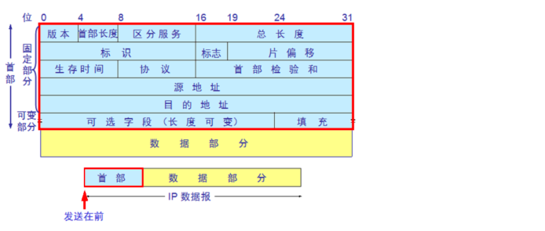

概念
======

### 基本概念

- 网络层
  - 子网掩码:用来在ip地址当中通过and操作，得到网络部分
    - 如果和本主机的网络部分一样，那么不需要路由，直接发送到目标主机
    - 如果网络部分不同，那么通过路由器转发表，根据最长匹配规则，将数据宝转发到其他网络当中。
  - Network | destination |	Netmask	| Gateway |	Interface |	Metric
  - IP报文简单格式
    - 首部
      - 
      - 固定部分
        - 总长度:报头长度+数据部分长度之和
        - 片偏移:本分片在原始报文相对偏移
        - TTL ： 可经过的最大路由数 8bit大小
        - 协议 : 支出Ip报文携带的数据使用的什么协议
        - 源地址，目标地址: 32bit表示
      - 可变部分
  - IpV6
    - 背景： v4的地址空间当时即将被耗尽
  - OSPF
  
### 网络协议

- 应用
    - http，tls
- 传输
    - tcp,udp，sctp
- 网络
    - ip v4/v6,ospf,rip,icmp,igmp
- 数据链路

- 物理层

### 设备
- 路由器
    - 网络层
    - 作用
        - 隔离广播域，冲突域
- 交换机，网桥
    - 链路层
    - 隔离冲突域
- 集线器   
    - 物理层