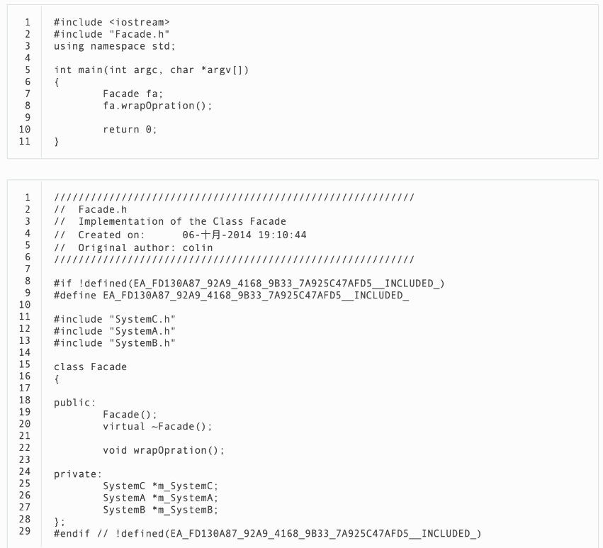
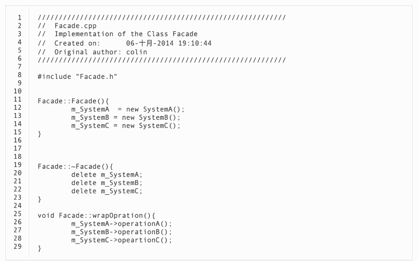
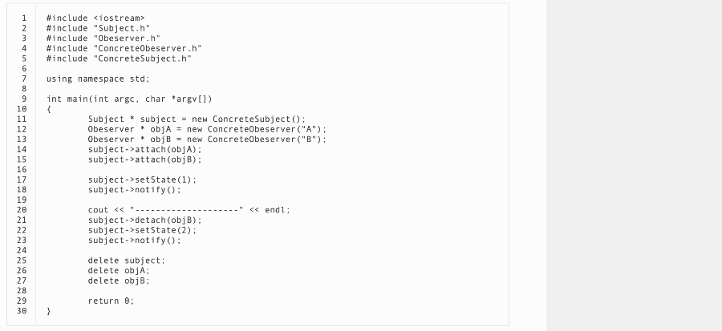
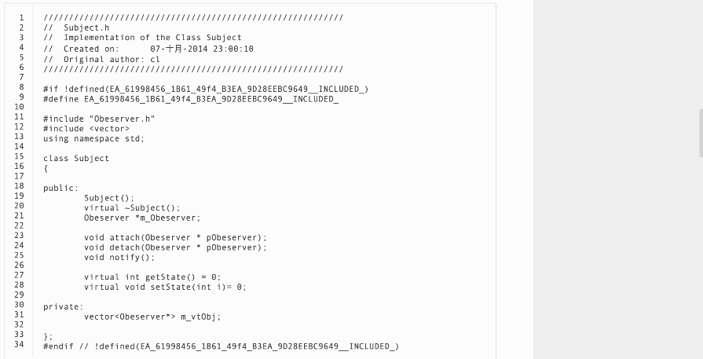
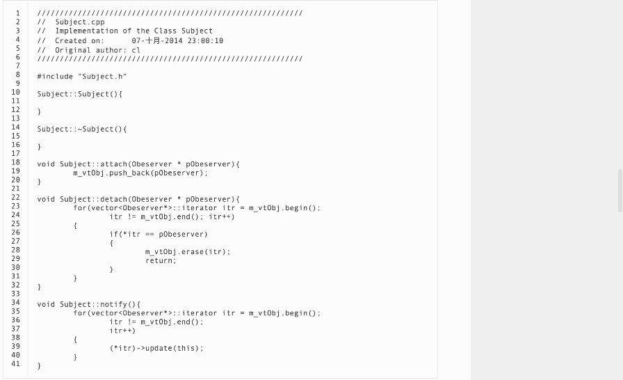
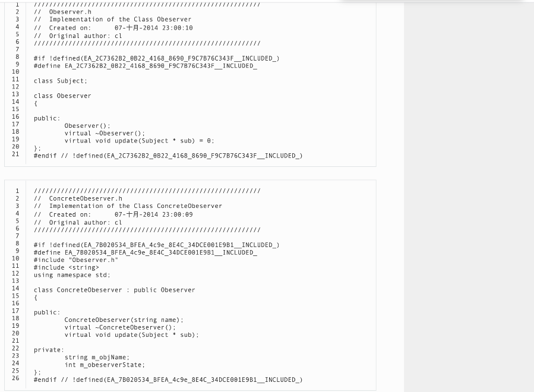
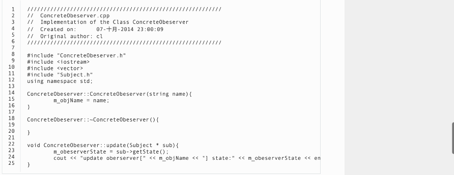

基本
=======
- 参考[Graphic Design Patterns](https://design-patterns.readthedocs.io/zh_CN/latest/creational_patterns/creational.html#)

### 创建型模式

- 高效的创建对象，因为创建对象消耗很多系统资源
- 举例
    - 单例模式
      - 确保一个类只有一个实例，而且自行实例化并向整个系统提供这个实例，这个类被称为单例类。
      - 优点:提供了对唯一实例的受控访问并可以节约系统资源；
      - 缺点:因为缺少抽象层而难以扩展，且单例类职责过重。
      - 适用场景:系统**只需要一个**实例对象；客户调用类的单个实例**只允许使用一个**公共访问点。
### 结构型
- 举例
  - 外观模式
    - 背景:外部与一个子系统的通信必须通过一个统一的外观对象进行，为子系统中的一组接口提供一个一致的界面，
      外观模式定义了一个高层接口，这个接口使得这一子系统更加容易使用
    - 代码
      - 
      - 
    - 优点:对客户屏蔽子系统组件，减少了客户处理的对象数目并使得子系统使用起来更加容易，
      它实现了子系统与客户之间的松耦合关系，并降低了大型软件系统中的编译依赖性，简化了系统在不同平台之间的移植过程
    - 缺点:不能很好地限制客户使用子系统类，而且在不引入抽象外观类的情况下，
      增加新的子系统可能需要修改外观类或客户端的源代码，违背了“开闭原则”。
    - 适用场景:要为一个复杂子系统提供一个简单接口；客户程序与多个子系统之间存在很大的依赖性；在层次化结构中，需要定义系统中每一层的入口，使得层与层之间不直接产生联系。

  - 代理模式
  - 组合模式
  - 适配器模式
  
### 行为型

- 举例
  - 观察者模式
    - 背景:该模式又叫发布订阅模式，一个对象发生改变时将自动通知其他对象，其他对象将相应做出反应
    - 代码
      - 
      - 
      - 
      - 
      - 
    - 优点:于可以实现表示层和数据逻辑层的分离，并在观察目标和观察者之间建立一个抽象的耦合，支持广播通信
    - 缺点:而且如果在观察者和观察目标之间有循环依赖的话，观察目标会触发它们之间进行循环调用，可能导致系统崩溃
    - 场景:
        - 抽象模型有两个方面，其中一个方面依赖于另一个方面
        - 一个对象的改变将导致其他一个或多个对象也发生改变,**不知道**具体有多少对象将发生改变
        - 一个对象必须通知其他对象，而并不知道这些对象是谁；需要在系统中创建一个触发链
  - 策略模式
      - 背景:完成一项任务，往往可以有多种不同的方式，每一种方式称为一个策略，
        我们可以根据环境或者条件的不同选择不同的策略来完成该项任务
        应当由**客户端自己决定**在什么情况下使用什么具体策略角色。
        策略模式仅仅封装算法，提供新算法插入到已有系统中，
        以及老算法从系统中“退休”的方便，**策略模式并不决定**在何时使用何种算法，
      - 优点：
          - 对“开闭原则”的完美支持，在不修改原有系统的基础上可以更换算法或者增加新的算法，
            它很好地管理算法族，提高了代码的复用性，是一种替换继承，避免多重条件转移语句的实现方式
      - 缺点
          - 客户端必须知道所有的策略类，并理解其区别，
            同时在一定程度上增加了系统中类的个数，可能会存在很多策略类
      - 场景
        - 系统需要动态地在几种算法中选择一种
        - 不希望客户端知道复杂的、与算法相关的数据结构，
          在具体策略类中封装算法和相关的数据结构，提高算法的保密性与安全性。
        - 避免使用难以维护的多重条件选择语句  
  - 迭代器模式
  

